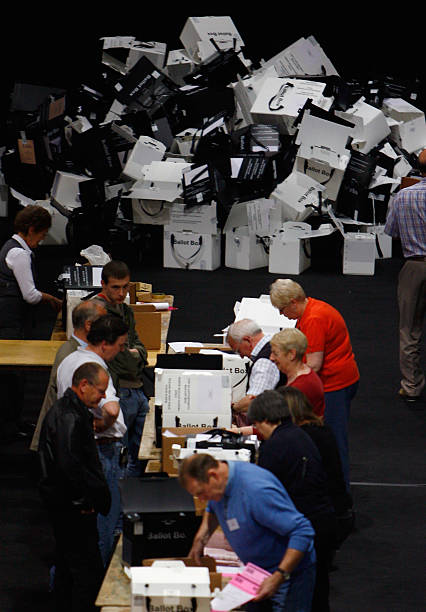
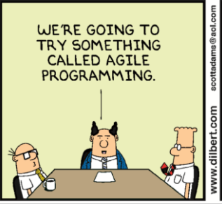
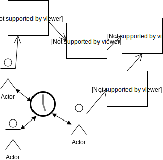

% Modelling Realistic User Behaviour in Socio-Technical System Simulation using Dynamic Code Fuzzing Aspects
%Tom Wallis and Tim Storer, School of Computing Science, University of Glasgow
% Aberystwyth, April 2018

---
header-includes:     "<style type='text/css'>.reveal section {text-align: left} .reveal h1, .reveal h2, .reveal h3, .reveal p {text-transform: none} .reveal h1 {font-size: 1.2em; } .floatleft {float: left} .reveal code {font-size: 12pt} pre.sourceCode {margin-top:2px; margin-left:2px; margin-top: 2px; margin-bottom:2px; margin-right:0pt}  div.sourceCode{margin-left:0px; margin-top: 0px; margin-bottom:0px} .reveal section img {border: 0px} </style>"

---

# About me

:::::::::::::: {.columns}
::: {.column width="60%"}
contents...
:::
::: {.column width="40%"}

:::
::::::::::::::

----

# Designing for user in <br/> Socio-Technical Systems

:::::::::::::: {.columns}
::: {.column style="width: 60%; text-align: left; float: left"}

Users really *are* the problem. Behaviour is:

 * Diverse, driven by different capabilities and expectations of systems.
 * Contingent on wider environmental factors.
 * Adaptive and evolutionary.

:::
::: {.column width="30%"}

:::
::::::::::::::

----

# Current Approaches to IS Engineering are Expensive

:::::::::::::: {.columns}
::: {.column style="width:40%; text-align: left; float: left"}

- Build, fail, rebuild
- Trial, error and revision
- Workarounds
:::
::: {.column style="width:55%; text-align: left; float: left"}

:::
::::::::::::::

------

# But, trying to model and predict the impact of user behaviour is really hard

:::::::::::::: {.columns}
:::{.column style="width: 60%; text-align: left; float: left"}

 * Idealised models miss vital nuances.
 * Detailed models quickly become unwieldy.
 * Stochastic models depend on homogeneity.
 * Socio-technical approaches, lack predictive capability.
:::
::: {.column width="30%"}

:::
::::::::::::::

----

# Intuition

:::{style="font-size: 36px"}
 * Need a convenient mechanism for introducing complex behaviour in stochastic simulations.

:::{style="font-size: 50px"}
> *Variability, contingency and adaption in user behaviour are cross cutting concerns.*
:::
* The same causes of variability affect different workflows.
* So, apply the *effects* as fuzzing aspects to functional descriptions of workflow behaviours.
:::

:::{.notes}
Develop a modelling technique that enables a separation of concerns between models of information systems, idealised workflows and the effect of realistic behaviour applied to those workflows.
:::

----

# Our Approach - Fuzzi Moss and Friends

:::{style="text-align:center"}

:::

---

# Case Study Selection - Team Based Software Development

:::::::::::::: {.columns}
:::{.column style="width: 50%; text-align: left; float: left; font-size:24pt"}

 * Actors have different roles
 * Development work coordinated around a centralised VCS.
 * Well defined ideal workflows, but with potential for variability
 * Different coordination workflows possible
 * Limited empirical evidence as to efficacy of different workflows [George & Williams,Israilidis et al., Bhat, T. & Nagappan].

:::
:::{.column style="width: 45%; text-align: center; float: right"}

:::
::::::::::::::

:::{.notes}

 * developer, project manager
 * change management, specification, implementation, testing, debugging, refactoring
 * Waterfall, TDD

:::

---

<section>
<h1>The Domain Model of a Software Project</h1>
:::{style="text-align:center"}

:::
</section>

<section>
<h3>Modelling Predictable Domain Properties - Debugging a Code Chunk</h3>

```{.python}
class Chunk(object):

    def debug(self, random, bug=None):

        if len(self.bugs) == 0:
            return False

        if bug is None or bug not in self.bugs:
            if random.unknown_bug_should_be_removed(self):
                bug = random.choose_bug(self)
                self.bugs.remove(bug)
        elif random.known_bug_should_be_removed(self):
            self.bugs.remove(bug)
            
    #...

```
</section>

---

# Workflow Class Model

:::{style="text-align:center"}

:::

---

<section>
<h1>Workflow Modelling Example - Change Management</h1>

:::{style="text-align:center"}

:::

</section>

<section>
<h3> ... and the code</h3>

```{.python}
class ChangeManagement(object):

    @default_cost(1)
    def resolve(self, conflict, random):
        self.centralised_vcs_client.resolve(conflict, random)

    def commit_changes(self, random):
        while True:
            try:
                self.centralised_vcs_client.commit()
                self.centralised_vcs_client.update(random)
                break
            except CentralisedVCSException:
                self.centralised_vcs_client.update(random)
                for conflict in self.centralised_vcs_client.conflicts:
                    self.resolve(conflict, random)


```
</section>

---

<section>
<h1>Workflow Modelling Example - Debugging</h1>

:::{style="text-align:center"}

:::

</section>

<section>
<h3>... and the code </h3>

```{.python}
class Debugging(object):
	
    @default_cost(1)
    def debug(self, feature, bug, random):
        feature.debug(random, bug)
	
    def debug_test(self, test, random):
        while True:
            try:
                test.exercise()
                break
            except BugEncounteredException as e:
                self.debug(test.feature, e.bug, random)
                self.change_management.commit_changes(random)
```
</section>

----


<section>
<h1>Workflow Modelling Example - <br/>Test Driven Development</h1>

:::{style="text-align:center"}

:::

</section>

<section>
<h3>... and the code </h3>

```{.python}
class TestDrivenDevelopment(object):

	#...

    def implement_feature_tdd(self, user_story, random):
        self.specification.add_feature(user_story.logical_name, user_story.size)
        self.testing.test_per_chunk_ratio(user_story.logical_name)
        self.implementation.implement_feature(user_story.logical_name)
        self.debugging.debug_feature(user_story.logical_name)
        self.refactoring.refactor_feature(user_story.logical_name)

    def work_from_backlog(self, product_backlog, random):
        while True:
            try:
                user_story = product_backlog.get(block=False)
                self.implement_feature_tdd(user_story, random)
            except Empty:
                break

```
</section>

----

<section>
<h1>Theatre_Ag Agent Simulation Environment </h1>
::::::::::::: {.columns}
:::{.column style="width: 60%; text-align: left; float: left; font-size:24pt"}

 * Theatre metaphor: actors, casts, scenes, episodes, directions
 * Actors are threads that:
     * synchronize on simulation clock ticks
     * execute a workflow until a task *cost* is encountered
     * waits for sufficient clock ticks to pass before proceeding
 * Tasks are passed as workflow instance method references and arguments
 * Actors can allocate each other tasks


:::
:::{.column style="width: 35%; text-align: center; float: right"}

:::
::::::::::::::
</section>

<section>
<h3>...and the code</h3>
```{.python}
reference_get_attr = workflow_class.__getattribute__

def __tracked_getattribute(self, item):

    attribute = reference_get_attr(self, item)

    def sync_wrap(*args, **kwargs):

        actor = self.actor
        actor.busy.acquire()
        actor.log_task_initiation(attribute, self, args)
        actor.incur_delay(attribute, self, args)
        actor.wait_for_turn()

        try:
            return attribute.im_func(self, *args, **kwargs)
        finally:
            actor.log_task_completion()
            actor.busy.release()

    sync_wrap.func_name = attribute.im_func.func_name
    return sync_wrap

workflow_class.__getattribute__ = __tracked_getattribute
```
</section>

---

# Aspect Weaving in Python

 * Desirable to separate idealised workflows and effects of realistic behaviour as a cross cutting concern.
 * Aspects allow for *quantification* and *obliviousness*.
 * Our implementation in Python: Asp


# Aspect Weaving Implementation

<section>
1. Replace the `object.__get_attribute__()` method to intercept all method invocations, to define an anonymous `wrap` function as substitute for the target method:

```{.python}
def weave_clazz(clazz, advice):

    def __weaved_getattribute__(self, item):
        attribute = object.__getattribute__(self, item)

            def wrap(*args, **kwargs):
            
            #...

            return wrap

    clazz.__getattribute__ = __weaved_getattribute__
```

</section>

<section style="text-align:left">

2. In `wrap`, retrieve *advice* for a target method from a user supplied dictionary:

```{.python}
            def wrap(*args, **kwargs):

                reference_function = attribute.im_func
                # Ensure that advice key is unbound method for instance methods.
                advice_key = getattr(attribute.im_class, attribute.func_name)

                aspect = advice.get(advice_key, identity)
```
</section>

<section>
3. In `wrap`, apply an aspect *prelude* to the target method and context:

```{.python}
            def wrap(*args, **kwargs):

                reference_function = attribute.im_func
                # Ensure that advice key is unbound method for instance methods.
                advice_key = getattr(attribute.im_class, attribute.func_name)

                aspect = advice.get(advice_key, identity)
                
                aspect.prelude(attribute, self, *args, **kwargs)
```

</section>

<section>
4. In `wrap`, execute the target method:

```{.python}
            def wrap(*args, **kwargs):

                reference_function = attribute.im_func
                # Ensure that advice key is unbound method for instance methods.
                advice_key = getattr(attribute.im_class, attribute.func_name)

                aspect = advice.get(advice_key, identity)
                
                aspect.prelude(attribute, self, *args, **kwargs)
                result = reference_function(*args, **kwargs)

```

</section>

<section>
5. In `wrap`, apply an aspect *encore* to the method, context and any return value, then return the result.

```{.python}
            def wrap(*args, **kwargs):

                reference_function = attribute.im_func
                # Ensure that advice key is unbound method for instance methods.
                advice_key = getattr(attribute.im_class, attribute.func_name)

                aspect = advice.get(advice_key, identity)
                
                aspect.prelude(attribute, self, *args, **kwargs)
                result = reference_function(*args, **kwargs)
                return aspect.encore(attribute, self, result)
                
```

</section>


# Altering Workfows with Dynamic Code Fuzzing using PyDySoFu

An *aspect prelude* that alters a reference representation of a function's abstract syntax tree each time the function is invoked. 

---

# Minimal Example

:::::::::::::: {.columns}
::: {.column width="40%"}

 * Define a target environment and workflow

:::
::: {.column width="60%"} 
```{.python}
class AWorkflow(object):
    def __init__(self, environment):
        self.environment = environment
    
    def a_method(self):
        self.environment.append(1)
        self.environment.append(2)
        self.environment.append(3)
environment = list()
target = AWorkflow(environment)
```

:::
::::::::::::::

. . .

:::::::::::::: {.columns}
::: {.column width="40%"}

 * Define a fuzzer and bind it to the workflow

:::
::: {.column width="60%"} 
```{.python}
def shuffle_steps(steps, context):
    return pydysofu_random.shuffle(steps)

advice = {AWorkflow.a_method: shuffle_steps}
Pydysofu.fuzz_clazz(AWorkflow, advice)
```

:::
::::::::::::::

. . .

:::::::::::::: {.columns}
::: {.column width="40%"}

 * Test

:::
::: {.column width="60%"} 

```{.python}
target.a_method()
print environment
```

:::
::::::::::::::

---

# A more complex example -<br/> [why do your children make you sick?](http://localhost:8888/notebooks/tutorial.ipynb)


<section>

1. Define the problem domain

```{.python}
class Hands(object):
    def __init__(self):
        self.clean = False
        self.soaped = False
```
</section>


<section>
2. Define the workflows 

:::::: {.columns}
:::{.column width="45%"}
```{.python}
class GetDirtyWorkflow(object):
    
    is_workflow = True
    
    def __init__(self, washable):
        self.washable = washable
        
    def dirty(self):
        self.washable.clean = False
        self.washable.soaped = False

class RinseWorkflow(object):

    is_workflow = True

    def __init__(self, washable):
        self.washable = washable

    def rinse(self):
        self.washable.soaped = False
```
:::

:::{.column width="50%"}
```{.python}
class WashWorkflow(object):

    is_workflow = True

    def __init__(self, washable):
        self.washable = washable
        self.rinse = RinseWorkflow(washable)

    def add_soap(self):
        self.washable.soaped = True

    def scrub(self):
        if self.washable.soaped:
            self.washable.clean = True

    def wash(self):
       self.add_soap()
       self.scrub()
       self.rinse.rinse()
       
```
:::
::::::
</section>

<section>
3. Define the fuzzer

```{.python}
from pydysofu import fuzz_clazz
from pydysofu.core_fuzzers import shuffle_steps

advice = {
    WashWorkflow.wash: shuffle_steps
}
fuzz_clazz(WashWorkflow, advice)
```
</section>

<section>
4. Try it out

```{.python}
hands = Hands()
get_dirty_workflow = GetDirtyWorkflow(hands)
wash_workflow = WashWorkflow(hands)

for _ in range(0, 10):
    get_dirty_workflow.dirty()
    wash_workflow.wash()
    print hands.clean
```

The output is something like:

```
True
False
True
...
```
</section>

---

# Implementation in PyDySoFu

<section>
1. In the prelude, retrieve the appropriate fuzzing function from a dictionary and invoke `fuzz function`:

~~~python
 class FuzzingAspect(IdentityAspect):
     def prelude(self, attribute, context):
        reference_function = attribute.im_func
        advice_key = getattr(attribute.im_class, attribute.func_name)
        
        fuzzer = self.fuzzing_advice.get(advice_key, identity)
        fuzz_function(reference_function, fuzzer, context)
~~~

</section>

<section>

2. In `fuzz_function`, recover the source code for a target method, build a copy of it's AST and pass to a visitor:

```python
 def fuzz_function(reference_function, fuzzer, context):
    func_source = inspect.getsourcelines(reference_function)[0]
    reference_syntax_tree = ast.parse(''.join(func_source))

    fuzzed_syntax_tree = copy.deepcopy(reference_syntax_tree)
    workflow_transformer = WorkflowTransformer(fuzzer=fuzzer, context=context)
    workflow_transformer.visit(fuzzed_syntax_tree)
```

</section>

<section>
3. In the visitor, extract the body of a function and apply the fuzzer:

```
    def visit_FunctionDef(self, node):
        result = self.generic_visit(node)
        node.body = self.fuzzer(node.body, self.context)
        return result
```

</section>


<section>
5. Compile the fuzzed AST and replace the target function's code object.

```{.python}
def fuzz_function(reference_function, fuzzer=identity, context=None):
    reference_syntax_tree = get_reference_syntax_tree(reference_function)

    fuzzed_syntax_tree = copy.deepcopy(reference_syntax_tree)
    workflow_transformer = WorkflowTransformer(fuzzer=fuzzer, context=context)
    workflow_transformer.visit(fuzzed_syntax_tree)

    compiled_module = compile(fuzzed_syntax_tree, '<potentially custom>', 'exec')
    reference_function.func_code = compiled_module.co_consts[0]
```

</section>

---

<section>
<h1> Modelling Distraction as a Fuzzing Function</h1>

Define a fuzzer that:

 * Draws a random number of steps to remove from the end of a function from a probability mass function on the remaining simulation time.
 * Recurses into nested control structures (While, For, Try)
 * Chooses the lowest, last n steps and replaces them with '`idle`'.

</section>

<section>
<h3> and the code.</h3>

```{.python}
def incomplete_procedure(random, pmf):
    
    def _incomplete_procedure(steps, context):
        clock = context.actor.clock
        remaining_time = clock.max_ticks - clock.current_tick

        probability = random.uniform(0.0, 0.9999)

        n = pmf(remaining_time, probability)

        choose_last_steps_fuzzer = choose_last_steps(n, False)

        fuzzer = in_sequence(
            [
                recurse_into_nested_steps(
                    target_structures={ast.While, ast.For, ast.TryExcept},
                    fuzzer=filter_steps(
                        choose_last_steps_fuzzer,
                        replace_steps_with(replacement='self.actor.idling.idle()')
                    )
                )
            ]
        )

        return fuzzer(steps, context)

    return _incomplete_procedure

```

</section>

---

# Evaluation Strategy

* Simulations of large scale systems are difficult to validate
  * Example: climate science
  * That's why we simulate
* Approach advocated by Naylor and Finger (1967) and others
  * Staged approach
  * Evaluate plausibility first
  * Gain confidence in predictive capability
  * Ask is the simulation *useful*?

---

# Case Study Experimental Setup

* Compare waterfall performance against TDD
* Project of up to 6 user stories, length 2 or 4
* 3 actor development team, 500 clock ticks maximum
* Apply fuzzing to top level or low level workflows
* Vary the extent of fuzzing by configuring distraction PMF


---

# Results

---

# No fuzzing -<br/> Commits Versus Project Size

:::::::::::::: {.columns}
::: {.column style="width:50%; text-align: left; float: left"}

 

:::
::: {.column tyle="width:35%; text-align: left; float: left"}

<br/>

 * Waterfall (<span style="color:blue">Blue</span>)
 * TDD (<span style="color:red">Red</span>)

:::
::::::::::::::

---

# No fuzzing -<br/> Mean Time to Failure Versus Project Size

:::::::::::::: {.columns}
::: {.column style="width:50%; text-align: left; float: left"}


:::
::: {.column tyle="width:35%; text-align: left; float: left"}

<br/>

 * Waterfall (<span style="color:blue">Blue</span>)
 * TDD (<span style="color:red">Red</span>)

:::
::::::::::::::

---

# Effect of Fuzzing on Feature Completion

<section>

:::::::::::::: {.columns}
::: {.column style="width:50%; text-align: left; float: left"}


:::
::: {.column tyle="width:35%; text-align: left; float: left"}

<br/>

 * Waterfall (<span style="color:blue">Blue</span>)
 * TDD (<span style="color:red">Red</span>)

:::
::::::::::::::

::: {style="clear:both"}
:::
Fuzzing Change Management, Implementation, Testing, Debugging, Refactoring.

</section>

<section>

:::::::::::::: {.columns}
::: {.column style="width:50%; text-align: left; float: left"}


:::
::: {.column tyle="width:35%; text-align: left; float: left"}

<br/>

 * Waterfall (<span style="color:blue">Blue</span>)
 * TDD (<span style="color:red">Red</span>)

:::
::::::::::::::

::: {style="clear:both"}
:::
Fuzzing Waterfall, TDD.

</section>

---

# Effect of Fuzzing on Mean Time to Failure

<section>

:::::::::::::: {.columns}
::: {.column style="width:50%; text-align: left; float: left"}


:::
::: {.column tyle="width:35%; text-align: left; float: left"}

<br/>

 * Waterfall (<span style="color:blue">Blue</span>)
 * TDD (<span style="color:red">Red</span>)

:::
::::::::::::::

::: {style="clear:both"}
:::
Large projects.

</section>

<section>

:::::::::::::: {.columns}
::: {.column style="width:50%; text-align: left; float: left"}


:::
::: {.column tyle="width:35%; text-align: left; float: left"}

<br/>

 * Waterfall (<span style="color:blue">Blue</span>)
 * TDD (<span style="color:red">Red</span>)

:::
::::::::::::::

::: {style="clear:both"}
:::
Small projects.

</section>


# Take away: model irregular user behaviour separately as cross cutting concerns.

Future:

 * Bigger, better case studies
 * Application of fuzzing to other representations
 * Validate models of irregular behaviour using process log data sets.

---

# Questions, Paper and Code.

Wallis, T and Storer T.  *Modelling Realistic User Behaviour in Information Systems Simulation as Fuzzing Aspects*. To Appear, CAISE Forum 2018.

Code repositories:

 * [http://github.com/twsswt/theatre_ag](http://github.com/twsswt/theatre_ag)
 * [http://github.com/twsswt/pydysofu](http://github.com/twsswt/pydysofu)
 * [http://github.com/probablytom/asp]([http://github.com/probablytom/asp)
 * [http://github.com/twsswt/fuzzi-moss](http://github.com/twsswt/fuzzi-moss)
 * [http://github.com/twsswt/softdev-workflow](http://github.com/twsswt/softdev-workflow)


